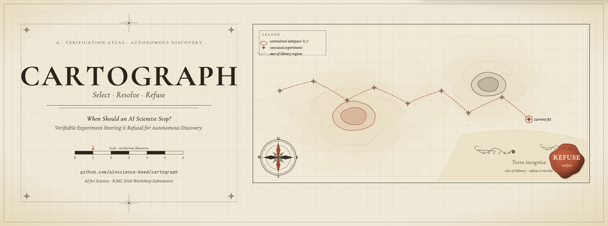

<p align="center">
  
</p>

# CARTOGRAPH Reproducibility Package

This folder contains the code and frozen result artifacts needed to reproduce
the experiments reported in the CARTOGRAPH AI4Science workshop paper.

## What Is Included

- `alab_retraction_audit.py`: retrospective A-Lab audit from public corrected supplementary data.
- `cascade_boed_robustness.py` and `cascade_boed_benchmark.py`: structured cascade benchmarks for CARTOGRAPH-A, EIG, Box-Hill, raw CARTOGRAPH, disagreement, and random.
- `pk_divergence_benchmark.py`, `pk_failure_benchmark.py`, and `pk_aopt_upgrade_benchmark.py`: pharmacokinetic selection, revocation, and A-optimality checks.
- `real_data_topt_benchmark.py` and `real_data_one_step.py`: EPA CvTdb retrospective checks.
- `duffing_exact_check.py`: exact recovery sanity check.
- `scaling_experiment.py`: random-candidate scaling-law validation.
- `unresolved_boed.py`, `pk_first_pass.py`, `real_data_validation.py`, and `pk_boed_baselines.py`: shared utilities.
- `outputs/`: frozen JSON, Markdown summaries, and figures used to verify the reported numbers.
- `paper/`: snapshot of the TeX source and bibliography at packaging time.

The same scripts also appear in `scripts/` for convenience; the top-level
copies are the easiest to run because they expect `data/` and `outputs/` to
live beside the script files.

## Environment

Python 3.10+ is recommended.

```bash
python -m venv .venv
source .venv/bin/activate
pip install -r requirements.txt
```

## Public Data

The synthetic, Duffing, cascade, and PK-simulation benchmarks do not require
external data. The EPA and A-Lab audits require public files that are not
bundled here to keep the repository lightweight. See
`data_instructions/DATA.md` for the expected paths and download notes.

## Reproducing Key Results

Run from this folder after installing requirements and downloading optional
public data:

```bash
python scaling_experiment.py
python duffing_exact_check.py
python cascade_boed_robustness.py
python pk_divergence_benchmark.py
python pk_failure_benchmark.py
python real_data_topt_benchmark.py
python alab_retraction_audit.py
```

Each script writes a self-contained summary under `outputs/<experiment>/`.
The A-Lab audit is deterministic; its bootstrap calibration diagnostic uses
seed `0`, recorded in `outputs/alab_audit/alab_audit_results.json`.

Optional parser sanity checks:

```bash
pytest tests
```

## Expected Headline Checks

- Cascade robustness: CARTOGRAPH-A dominates at `d=8` and `d=16`; see
  `outputs/cascade_boed_robustness/final_and_latest_results.md`.
- PK failure/refusal: all reported out-of-library PK mechanisms are revoked
  under the calibrated refusal window; see `outputs/pk_failure/`.
- EPA retrospective: the fit-stable subset is a feasibility check rather than
  a superiority claim; see `outputs/real_data_topt/`.
- A-Lab retrospective audit: the guard flags `4/4` post-correction
  inconclusive positive claims and passes `32/36` confirmed positive claims;
  see `outputs/alab_audit/final_and_latest_results.md`.
